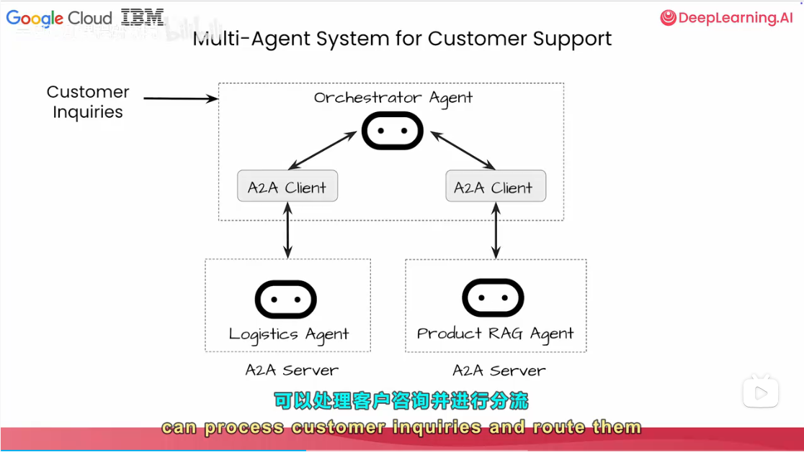
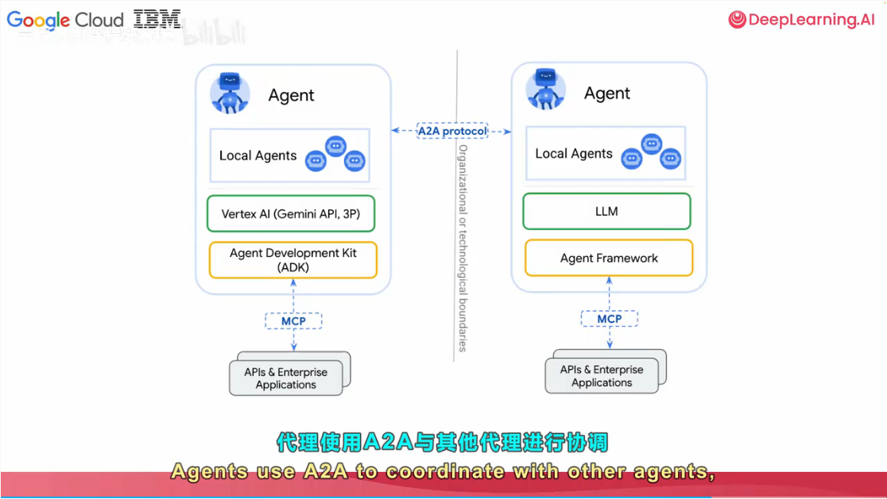
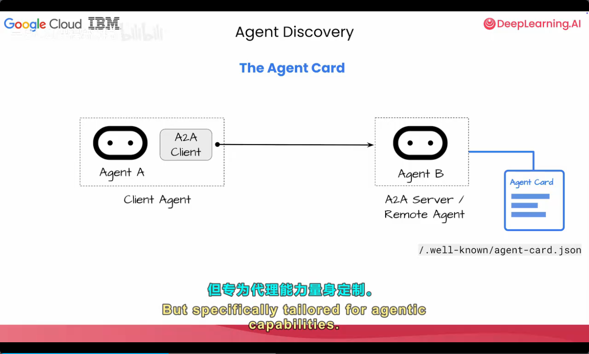
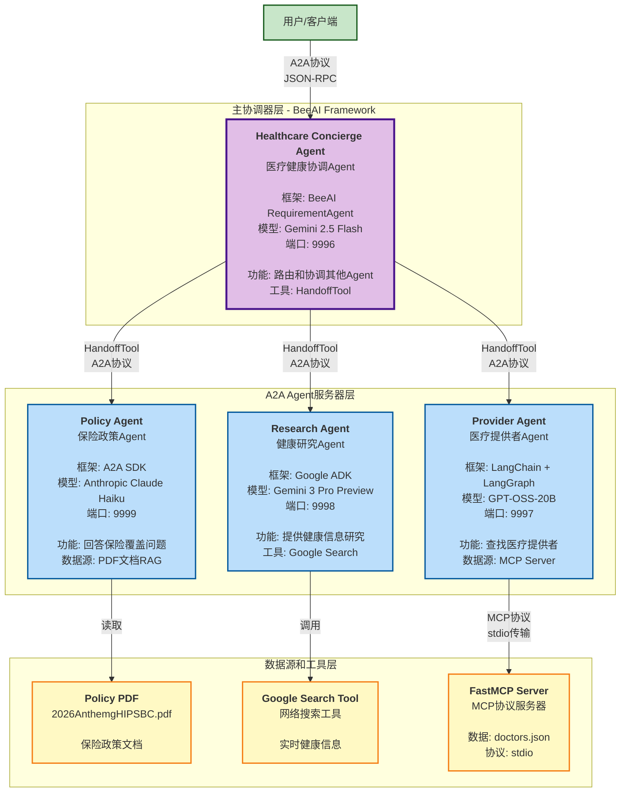
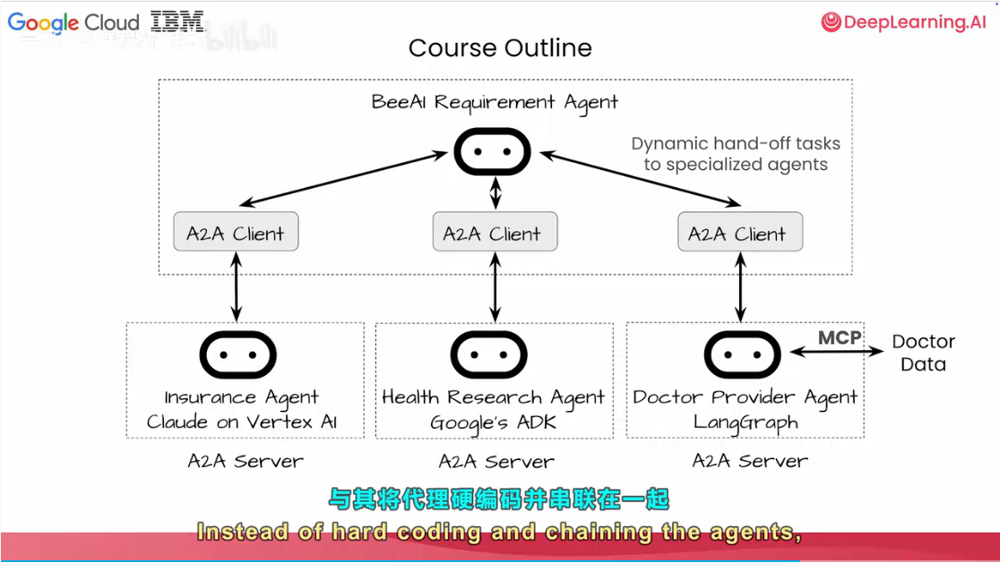

> agent

# A2A

## 1 what

### 2 why

### 4 快速入门

# 核心

agent card

四种不同通讯方式

# example

## 医疗agent

```mermaid
graph TD
    %% 用户层
    User[用户/客户端]
    
    %% 主协调器层
    subgraph OrchestratorLayer [主协调器层 - BeeAI Framework]
        Concierge["<b>Healthcare Concierge Agent</b><br/>医疗健康协调Agent<br/><br/>框架: BeeAI RequirementAgent<br/>模型: Gemini 2.5 Flash<br/>端口: 9996<br/><br/>功能: 路由和协调其他Agent<br/>工具: HandoffTool"]
    end

    %% A2A Agent服务器层
    subgraph A2AAgents [A2A Agent服务器层]
        direction TB
        
        PolicyAgent["<b>Policy Agent</b><br/>保险政策Agent<br/><br/>框架: A2A SDK<br/>模型: Anthropic Claude Haiku<br/>端口: 9999<br/><br/>功能: 回答保险覆盖问题<br/>数据源: PDF文档RAG"]
        
        ResearchAgent["<b>Research Agent</b><br/>健康研究Agent<br/><br/>框架: Google ADK<br/>模型: Gemini 3 Pro Preview<br/>端口: 9998<br/><br/>功能: 提供健康信息研究<br/>工具: Google Search"]
        
        ProviderAgent["<b>Provider Agent</b><br/>医疗提供者Agent<br/><br/>框架: LangChain + LangGraph<br/>模型: GPT-OSS-20B<br/>端口: 9997<br/><br/>功能: 查找医疗提供者<br/>数据源: MCP Server"]
    end

    %% 数据源和工具层
    subgraph DataLayer [数据源和工具层]
        direction LR
        
        PDF["<b>Policy PDF</b><br/>2026AnthemgHIPSBC.pdf<br/><br/>保险政策文档"]
        
        GoogleSearch["<b>Google Search Tool</b><br/>网络搜索工具<br/><br/>实时健康信息"]
        
        MCPServer["<b>FastMCP Server</b><br/>MCP协议服务器<br/><br/>数据: doctors.json<br/>协议: stdio"]
    end

    %% 连接关系
    User -->|"A2A协议<br/>JSON-RPC"| Concierge
    
    Concierge -->|"HandoffTool<br/>A2A协议"| PolicyAgent
    Concierge -->|"HandoffTool<br/>A2A协议"| ResearchAgent
    Concierge -->|"HandoffTool<br/>A2A协议"| ProviderAgent
    
    PolicyAgent -->|"读取"| PDF
    ResearchAgent -->|"调用"| GoogleSearch
    
    ProviderAgent -->|"MCP协议<br/>stdio传输"| MCPServer

    %% 样式定义
    classDef orchestrator fill:#e1bee7,stroke:#4a148c,stroke-width:3px;
    classDef agent fill:#bbdefb,stroke:#01579b,stroke-width:2px;
    classDef datasource fill:#fff9c4,stroke:#f57f17,stroke-width:2px;
    classDef user fill:#c8e6c9,stroke:#1b5e20,stroke-width:2px;
    
    class Concierge orchestrator;
    class PolicyAgent,ResearchAgent,ProviderAgent agent;
    class PDF,GoogleSearch,MCPServer datasource;
    class User user;
```

# project

多智能体协调, 

然别帮你干

创建agent的agent

> 或许这样就能解决上下文了

